<p align="center">
  
</p>

<p align="center">
    <a href="./README.md">中文说明</a> | <a href="./README.en.md">English Manual</a>
</p>

# 0x01: MarkTrans — ⚡ Project Overview

**MarkTrans** is a Markdown converter built in Python and powered by a **rule engine**.  
By reading preconfigured rules in `/res/database.db`, it converts Markdown text into HTML structures required by your target scenario.

This project adopts a two-stage architecture:

1. **AST Conversion**: Parse Markdown into AST through a configurable SQLite rule base.
2. **HTML Rendering**: Render AST into custom HTML structures according to style rules.

With this architecture, MarkTrans can recognize and convert various non-standard Markdown extensions. It is suitable for self-media workflows and static-site pipelines that require deep customization.

# 0x02: MarkTrans — 🎬 Project Preview


# 0x03: MarkTrans — 🚀 Quick Start
## 0x0301: MarkTrans · Quick Start — Requirements

- Python 3.8+
## 0x0302: MarkTrans · Quick Start — Install and Run

1. **Clone the repository**

```bash
git clone https://github.com/Blue-Seventeen/MarkTrans.git
cd MarkTrans
```

2. **Install dependencies**

```bash
pip install -r requirements.txt
```

3. **Start the web service**

```
python app.py
```

# 0x04: MarkTrans — 📂 Project Structure
## 0x0301: MarkTrans · Project Structure — Directory Layout

Although there are many files, the core is mainly three parts:  
`database.db` for mapping rules, `markdown_ast_parser.py` for Markdown → AST, and `ast_html_translator.py` for AST → HTML.

```
MarkTrans/
├── doc/        # development documents
├── res/        # resource files
│   ├── images/         # image assets
│   ├── static/         # frontend js/css resources
│   ├── templates/      # frontend html templates
│   ├── database.db     # (core) conversion rules database
│   └── database_template.db    # (core) template database used to recover database.db
├── src/        # code resources
│   ├── main/    # main source code (project core)
│   │   ├── ast_html_translator/ # (core) read DB rules to render AST into HTML
│   │   └── markdown_ast_parser/ # (core) read DB rules to parse Markdown into AST
│   └── test/    # test resources (mainly for validating main modules)
│       ├── ast_html_translator/   # tests for ast_html_translator
│       └── markdown_ast_parser/   # tests for markdown_ast_parser
├── app.py      # web page service for function demonstration
└──  database.py # database service to reset database.db from database_template.db
```
## 0x0302：MarkTrans · Project Structure — Database Structure

The core of this project is the three tables in `database.db` (SQLite).  
These tables store mapping rules and render templates. Understanding them means understanding the conversion principle of the entire project.

### 1. Table `mapping_base`

`mapping_base` stores all Markdown formats currently supported by this project:

```mysql
id : int, auto-increment, identifies each Markdown style
element_name : str, Chinese style name (e.g., 一级标题)
element_name_en : str, unique, English style name (e.g., Heading 1)
element_description: str, notes for this Markdown format (e.g., block format starting with # + space)
element_category：str, format category [（Block Elements）| （Inline Elements）]
weight : int, priority weight; higher values are processed first
ast_example_input : str, sample input (e.g., # 一级标题)
ast_example_output : str, expected AST sample output
element_regex_rule : str, regex used to match this format (e.g., ^# (.*)\n?)
element_handler_name: str, handler function name used to parse this format
```

Notes:

1. **element_category**: Block formats occupy a whole block (code blocks, blockquotes, headings, etc.). Inline formats can be embedded inside block formats (bold, italic, etc.).
2. **element_regex_rule**: Some complex formats cannot be fully matched by one regex. In those cases, use regex for the prefix and complete the rest with code logic.
3. **element_handler_name**: Specifies which function in `markdown_ast_parser.py` handles this format.

### 2. Table `mapping_style`

`mapping_style` manages user-defined style groups (AST => HTML template groups), so users can switch styles in one click:

```mysql
id : int, auto-increment, style id
style_name : str, style name (e.g., default style)
is_active : int, whether this style is currently active (1 active, 0 inactive)
is_deletable : int, whether this style can be deleted (0 means protected)
remark : str, custom style notes
```

Notes:

1. **is_active**: Multiple styles can exist, but only one style is active at a time.
2. **is_deletable**: The system default style (`id = 1`) is not recommended to delete, because the system needs a fallback style.

### 4. Table `mapping_rule`

`mapping_rule` stores specific AST→HTML mapping templates and matching rules:

```mysql
id : int, primary key, auto-increment
style_id : int, style id, linked to mapping_style
style_rule_name: str, style rule name (e.g., 一级标题)
ast_input : str, AST sample input (parsed by markdown_ast_parser.py)
matching_rule : str, matching expression; if token matches, html_output is applied
html_output : str, HTML render template; placeholders use `§token['属性']§`
render_name: str, should align with token type_name, determines render method
weight: int, rule priority (grouped by style_id)
```

# 0x05: MarkTrans — 🛠️ Extension Development

Before extension development, one note: the original release plan intended to provide HTML templates for all 44 supported formats, but due to workload, only 14 were fully configured.

Following the principle of “teach how to fish,” the core engine is already complete.  
The remaining work is mostly custom render templates. Below are two examples showing how to extend Markdown support and render desired HTML.

## 0x0501：MarkTrans · Extension Development — Easy Heading 1

The first case is compatibility for Heading 1 format (easy level).
### 1. Add new format in `mapping_base`

To support Heading 1, first add one row in `mapping_base` (via the Web “Rules and Data Management” page):

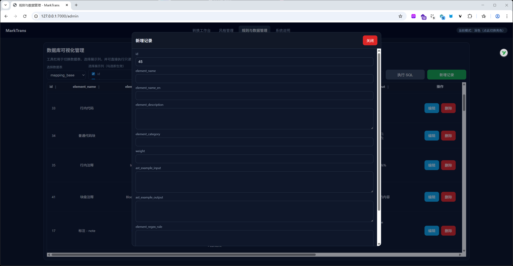

What needs to be filled:

1. **element_name**: Chinese format name (e.g., 一级标题)
2. **element_name_en**: English format name (e.g., Heading 1)
3. **element_description**: Description (optional)
4. **element_category**: Format category (Heading is block-level)
5. **weight**: Rule priority
6. **ast_example_input**: Markdown sample input
7. **ast_example_output**: Expected AST design
8. **element_regex_rule**: Regex used to match this format
9. **element_handler_name**: Handler function name

Among these fields, **ast_example_output** and **element_regex_rule** require design.

```bash
{                       # This block is called a token
  "type": "heading",    # Format type
  "raw": "# Title\n",   # Original matched text
  "depth": 1,           # Heading level
  "text": "Title",      # Plain heading text
  "tokens": [           # Recursive inline parse result
    {
      "type": "text",
      "raw": "Title",
      "text": "Title"
    }
  ]
}
```

Regex example for Heading 1:

```bash
^# (.*)\n?
```

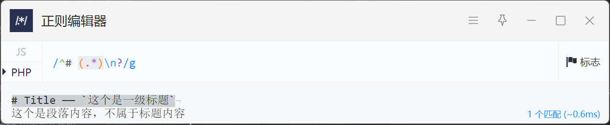

Final configured result:

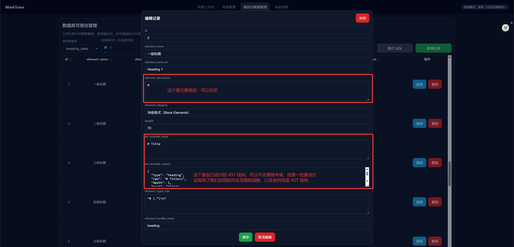
### 2. Add handler in `markdown_ast_parser`

After defining the format and regex, implement the corresponding parser handler in `markdown_ast_parser.py`:

```python
@print_return
def _handle_myCustomSyntax(self, match, rule, text):
    """
    :param match: regex match object
    :param rule: current matched rule
    :param text: remaining source text
    :return: token, consumed length
    """
    # parse logic...
    return token, consumed_length
```

Example implementation for heading (`_handle_heading`):

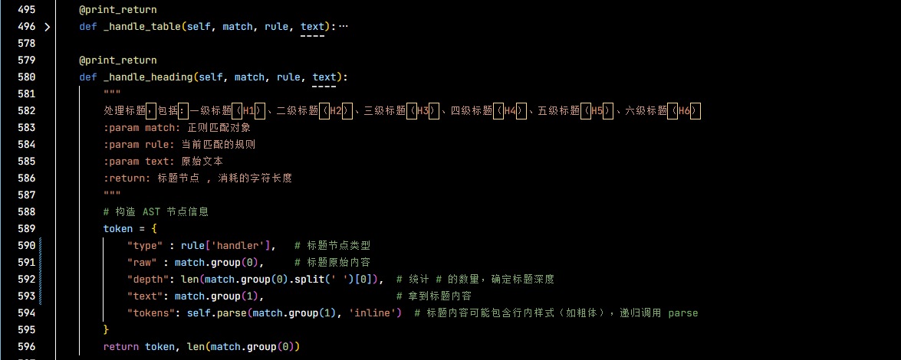

Because heading text may contain inline formatting, `tokens` is parsed recursively using inline scope.

### 3. Add mapping rule in `mapping_rule`

After Markdown→AST works, configure AST→HTML rendering.

Create a custom style based on default style:

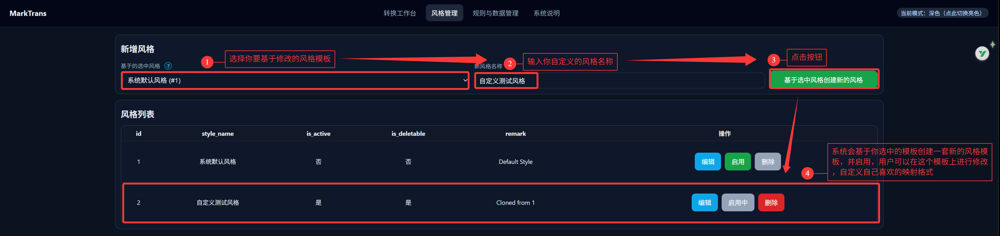

Then edit/add rules:

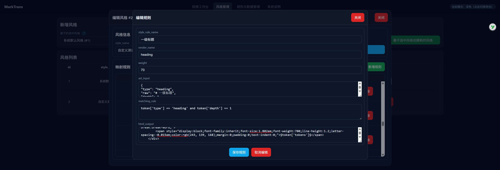

Key fields:

1. **style_rule_name**
2. **render_name**
3. **weight**
4. **ast_input**
5. **matching_rule**
6. **html_output**

For heading level 1:

```bash
token['type'] == 'heading' and token['depth'] == 1
```

Simple HTML template:

```bash
<h1>§token['tokens']§</h1>
```

Styled template:

```html
<div dir="ltr" style="display:block;clear:left;margin:-2em 0 -3em 0;position:relative;white-space:break-spaces;word-break:break-word;">
        <span style="display:block;font-family:inherit;font-size:1.802em;font-weight:700;line-height:1.2;letter-spacing:-0.015em;color:rgb(243, 139, 168);margin:0;padding:0;text-indent:0;">§token['tokens']§</span>
    </div>
```

Final form:

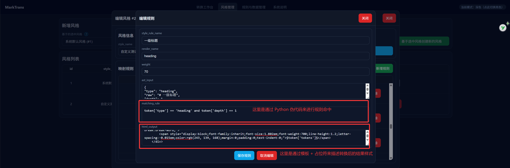
### 4. Add renderer in `ast_html_translator.py`

Implement AST→HTML render function:

```python
def _render_myCustomSyntax(self, token, rule_list):
    """
    :param token : target AST node
    :param rule_list : matched rules
    :return "rendered html"
    """
    # render logic
    return html_output_template
```

For most simple cases, rendering is template replacement.  
A common helper `_render_easy()` can be used directly:

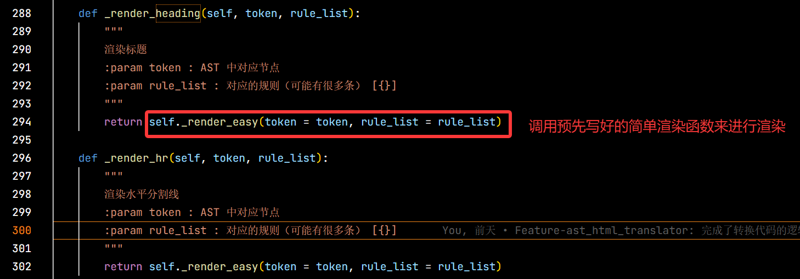

Result preview:

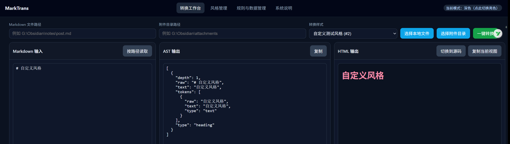

Cyberpunk alternative:

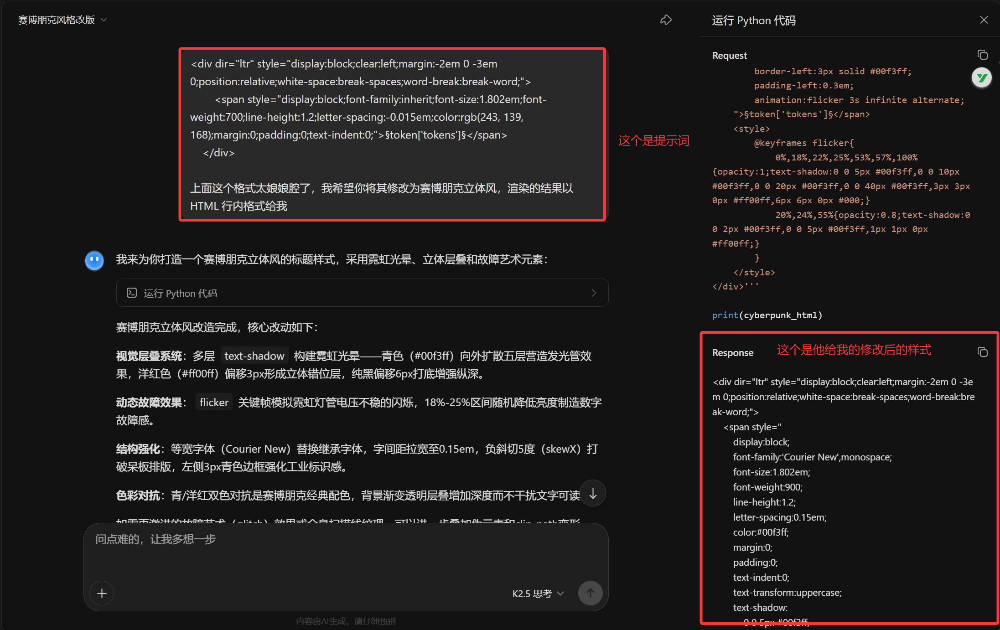

Update template in `mapping_base`:

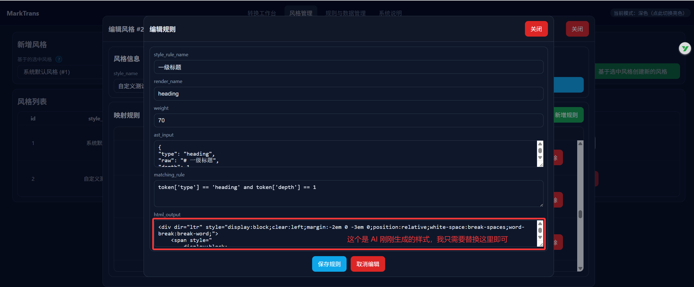

Re-run conversion:

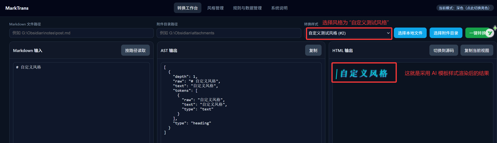

At this point, one complete simple syntax extension is done.

## 0x0502：MarkTrans · Extension Development — Hard Table

Second case: Table format (hard level).  
At the time of writing, support was still under development.

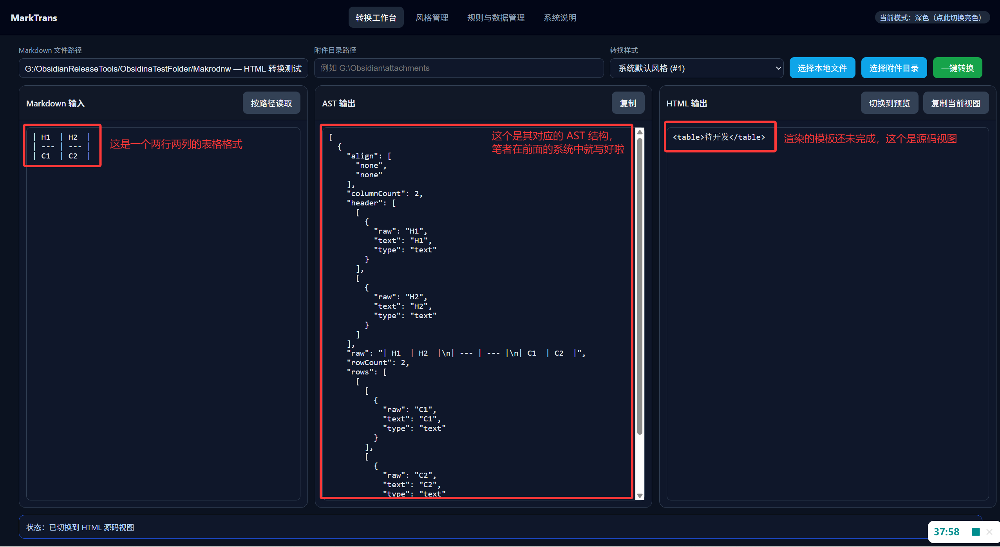

### 1. Add format in `mapping_base`

Go to “Rules and Data Management”, find “table” rule:

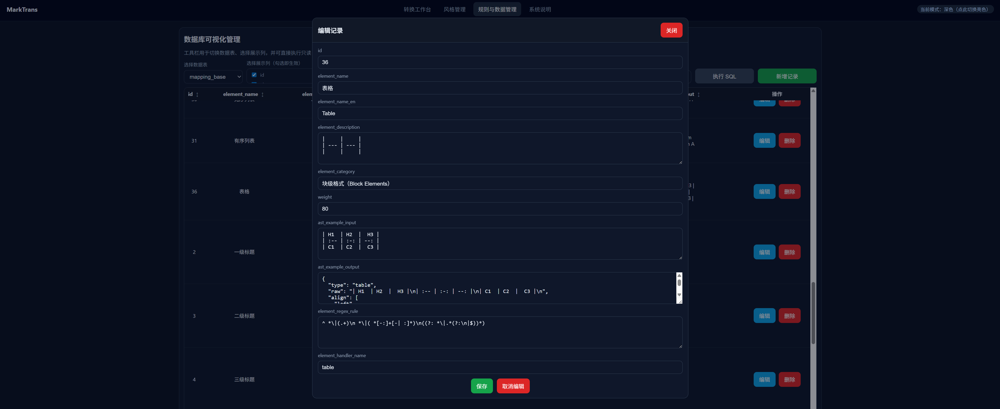

Main concerns: AST design and regex design.

For table AST, useful information includes:

1. Column alignment -> `align`
2. Row/column counts -> `rowCount`, `columnCount`
3. Header structure -> `header`
4. Row cell structure -> `rows`

AST sample:

```json
{
    "type" : "table",
    "raw": "| H1  | H2  |\n| --- | --- |\n| C1  | C2  |",
    "align" : ["center", "center"],
    "rowCount": 2,
    "columnCount" : 2,
    "header" : [
        [第一列标题的格式组],
        [第二列标题的格式组]
    ],
    "rows" : [
        [[第一列内容的格式组],[第二列内容的格式组]]
    ]
}
```

Regex sample:

```bash
^ *\|(.+)\n *\|( *[-:]+[-| :]*)\n((?: *\|.*(?:\n|$))*)
```

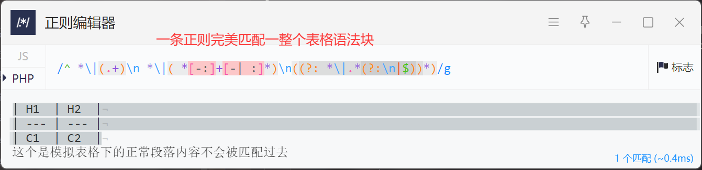

### 2. Add handler in `markdown_ast_parser`

Implement `_handle_table()` to extract rows, columns, alignments and build AST node:

```python
 @print_return
    def _handle_table(self, match, rule, text):
        """
        处理表格节点
        :param match: 正则匹配对象
        :param rule: 当前匹配的规则
        :param text: 原始文本
        :return: 表格节点 , 消耗的字符长度
        | H1  | H2  |  H3 |
        | :-- | :-: | --: |
        | C1  | C2  |  C3 |
        """
        # 1. 从表格中提取出标题行，对齐信息，表格内容(可能没有)
        raw = match.group(0) if match.group(0).split("\n")[-1] != '' else match.group(0)[:-1]
        title_row = raw.split("\n")[0]
        align_row = raw.split("\n")[1]
        content_rows = raw.split("\n")[2:] if len(raw.split("\n")) > 2 else []
        ...
```

### 3. Add render mappings in `mapping_rule`

Generate a style first:

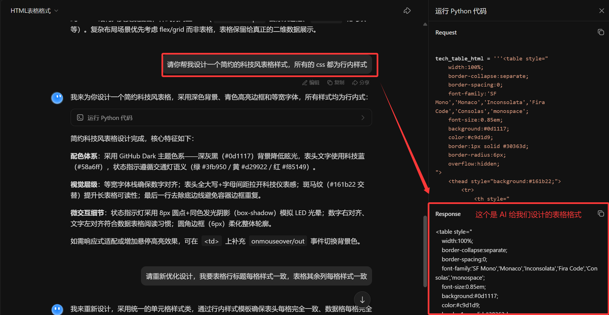

Simplified version:


Single-row/single-cell template sample:

```html
<table style="
    width:100%;
    border-collapse:separate;
    border-spacing:0;
    font-family:'SF Mono','Monaco','Inconsolata','Fira Code','Consolas','monospace';
    font-size:0.85em;
    background:#0d1117;
    color:#c9d1d9;
    border:1px solid #30363d;
    border-radius:6px;
    overflow:hidden;
">
    <thead style="background:transparent;">
        <tr>
            <th style="padding:12px 16px;text-align:center;font-weight:600;color:#58a6ff;border-bottom:2px solid #21262d;text-transform:uppercase;letter-spacing:0.05em;font-size:0.9em;">ID</th>
        </tr>
    </thead>
    <tbody>
        <tr style="background:#161b22;">
            <td style="padding:10px 16px;border-bottom:1px solid #21262d;color:#f0f6fc;text-align:center;">#A001</td>
        </tr>
    </tbody>
</table>
```

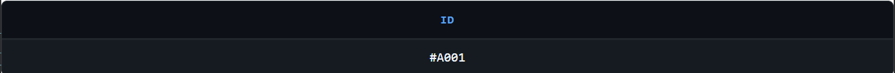

Render by blocks: `<table>`, `<th>`, `<tr>`, `<td>`.

#### 3.1 Add Rule — table · \<table\>

```html
<table style="
    width:100%;
    border-collapse:separate;
    border-spacing:0;
    font-family:'SF Mono','Monaco','Inconsolata','Fira Code','Consolas','monospace';
    font-size:0.85em;
    background:#0d1117;
    color:#c9d1d9;
    border:1px solid #30363d;
    border-radius:6px;
    overflow:hidden;
">
    <thead style="background:transparent;">
        <tr>
            §表格 — <th>§
        </tr>
    </thead>
    <tbody>
            §表格 — <tr>§
    </tbody>
</table>
```

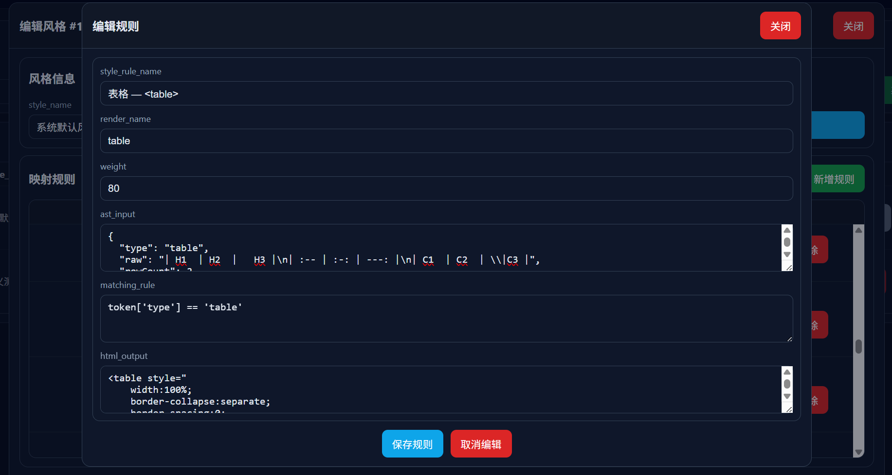
#### 3.2 Add Rule — table · \<th\>

```html
<th style="padding:12px 16px;text-align:center;font-weight:600;color:#58a6ff;border-bottom:2px solid #21262d;text-transform:uppercase;letter-spacing:0.05em;font-size:0.9em;">§text§</th>
```

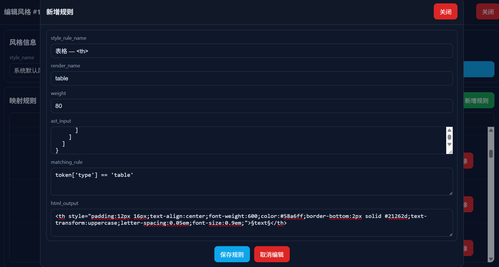
#### 3.3 Add Rule — table · \<tr\>

```html
<tr style="background:#161b22;">
    §td§
</tr>
```

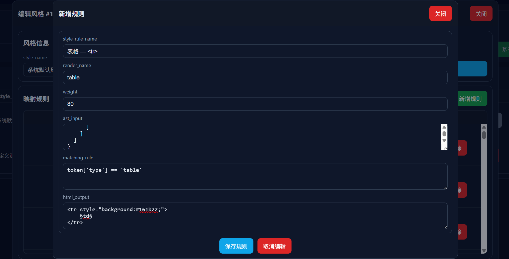
#### 3.4 Add Rule — table · \<td\>

```bash
<td style="padding:10px 16px;border-bottom:1px solid #21262d;color:#f0f6fc;text-align:center;">§text§</td>
```

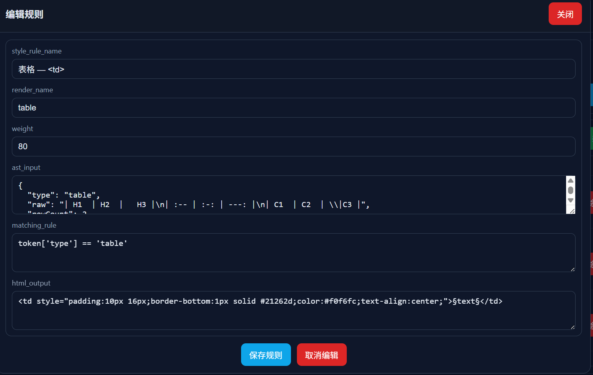
### 4. Add render function in `ast_html_translator.py`

```python
def _render_table(self, token, rule_list):
    """
    渲染表格
    :param token : AST 中对应节点
    :param rule_list : 对应的规则（可能有很多条） [{}] 
    """
    html_output_template = "" # 存放最终的渲染结果的
    ...
```

Render result:

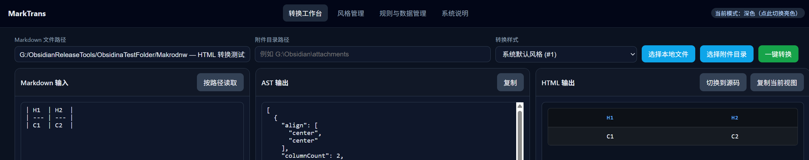

You can also expand it to 3x3 with nested inline styles:

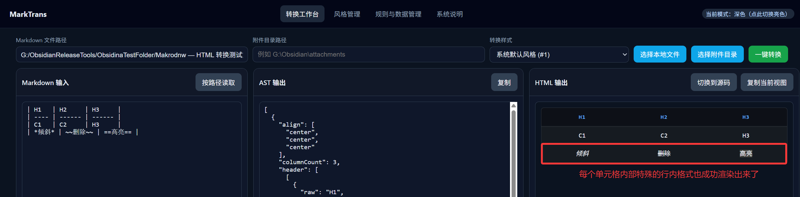

At this point, a full complex syntax extension is completed.

## ❤️ Support the Project

If this project or handbook helps you, feel free to buy the author a coffee  
(when donating, you can leave: nickname + project name (MarkTrans) + suggestions/message; sponsor acknowledgements are updated periodically) ☕

<p align="center">
  
    
    
</p>

You can also support the project by:

- Giving the repository a Star
- Submitting Issue / PR
- Sharing practical feedback

## 🤝 Community & Learning

Welcome to join the community channels for discussions and updates:

<p align="center">
  
  
</p>