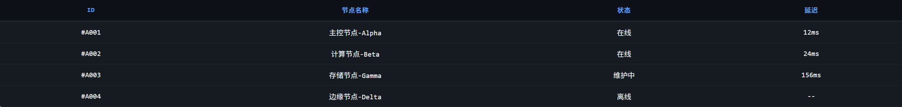

# Obsidian 发布转换全量测试文档

这是一份用于验证 `plugin-mp.weixin.qq.com` 发布链路的综合样例文档。

建议测试时使用当前文件所在目录作为附件目录，也就是本文同级目录。本文会覆盖：

- Markdown -> AST -> HTML 基础转换
- 本地 Markdown 图片上传
- Obsidian 嵌入图片上传
- 远程图片转存到微信
- 常见排版元素与 Obsidian 扩展语法

---

## 1. 标题层级

### 1.1 H3 标题

#### 1.1.1 H4 标题

##### 1.1.1.1 H5 标题

###### 1.1.1.1.1 H6 标题

---

## 2. 行内样式

这是一段普通正文，包含 **加粗**、*斜体*、~~删除线~~、==高亮==、`行内代码`，以及转义字符：\*这段文字不应该被解析成斜体\*。

这里再放一个组合样式示例：**加粗里包含 `inline code`**，以及一个脚注引用[^publish-footnote]。

---

## 3. 链接与 WikiLink

- 普通链接：[Obsidian 官方网站](https://obsidian.md/)
- 普通链接（用于公众号外链保留测试）：[微信公众平台](https://mp.weixin.qq.com/)
- WikiLink：[[关联说明文档]]
- WikiLink 别名：[[关联说明文档|关联说明文档（别名展示）]]

> 这段区块引用用于检查引用样式是否能正确落到 HTML 中。
> 第二行继续引用，验证多行 blockquote 的合并逻辑。

---

## 4. 列表

### 4.1 无序列表

- 第一项
- 第二项
- 第三项里包含一个链接：[查看详情](https://example.com/)

### 4.2 有序列表

1. 先解析 Markdown。
2. 再处理 AST 中的图片资源。
3. 最后将 HTML 发送到微信草稿接口。

### 4.3 任务列表

- [x] 本地附件路径已确定
- [x] AST 图片节点已预处理
- [ ] 手动确认公众号草稿中的最终样式

### 4.4 混合嵌套列表

1. 一级任务 A
   - 子任务 A-1
   - 子任务 A-2
2. 一级任务 B
   - 子任务 B-1
   - 子任务 B-2

---

## 5. Callout

> [!note]
> 这是一个 note callout，用于验证基础提示框转换。

> [!tip] 小提示
> 如果你要测试本地图片上传，请将附件目录指向当前文件所在目录。

> [!warning]
> 下面的远程图片依赖网络，请在可联网环境下测试。

> [!example]
> 这个 callout 中包含 `行内代码` 和 **强调文本**。

> [!danger]
> ```python
> def publish_to_wechat():
>     return "draft created"
> ```

---

## 6. 图片资源

### 6.1 远程图片

下面这张图用于验证“远程图片先下载/上传，再回写 AST，再生成 HTML”的链路：


### 6.2 本地 Markdown 图片

下面这张图用于验证标准 Markdown 图片节点 `image.src` 的上传与替换：



### 6.3 Obsidian 嵌入图片

下面这张图用于验证 Obsidian 嵌入图片节点 `embed.target/src` 的上传与替换：

![[本地嵌入图片.jpeg|520]]

### 6.4 图片与正文混排

图前文字，检查段落和图片之间的顺序。


图后文字，检查图片后续段落是否仍能正常输出。

---

## 7. 代码块

```bash
python app.py
pytest plugins/plugin-mp.weixin.qq.com/test -q
```

```python
def build_payload(article_path: str, attachment_directory_path: str) -> dict:
    return {
        "article_path": article_path,
        "attachment_directory_path": attachment_directory_path,
        "marktrans_style_id": 1,
    }
```

```json
{
  "title": "测试文档",
  "attachment_directory_path": "./lib/marktrans/res/test",
  "thumb_image": "./lib/marktrans/res/test/local-inline-image.png"
}
```

---

## 8. 表格

| 字段 | 含义 | 备注 |
| :--- | :---: | ---: |
| article_path | 文章路径 | 必填 |
| attachment_directory_path | 附件目录路径 | 建议与文章同目录 |
| article_markdown | Markdown 文本 | 可选 |
| article_ast | AST 结构 | 可选 |
| article_html | HTML 文本 | 可选 |

---

## 9. CardLink

```cardlink
url: https://docs.python.org/3/
title: "Python 3 Documentation"
description: "Python 官方文档首页，用于验证 cardlink 解析与 HTML 生成。"
host: docs.python.org
favicon: https://www.python.org/static/favicon.ico
image: https://placehold.co/640x320/png?text=CardLink+Preview
```

```cardlink
url: https://github.com/
title: "GitHub"
description: "最小可读 cardlink 示例。"
```

---

## 10. 注释与分隔线

这段注释内容不应该出现在最终 HTML 中：

%%这是一段行内注释，理论上不应该在最终渲染结果中可见。%%

%%
多行注释也应该被忽略。
如果最终 HTML 里还能看到这段文字，说明 comment 处理链路有问题。
%%

---

## 11. 脚注

脚注引用示例：本文会在发布流程中经过 Markdown AST 解析，再进入微信图片上传中间层，最后生成 HTML 并创建草稿[^pipeline-note]。

[^publish-footnote]: 这里用于验证脚注引用与脚注内容是否都能进入 AST。
[^pipeline-note]: 这条脚注用于说明当前测试文档的目标是验证完整发布链路。

---

## 12. 预期检查项

如果转换系统工作正常，预期应当满足以下几点：

1. 标题、列表、表格、引用、Callout、代码块都能正常输出。
2. 远程图片不会直接原样进入草稿，而是被转存为微信可访问的图片 URL。
3. 本地 Markdown 图片和 Obsidian 嵌入图片都能显示，不再残留本地路径。
4. 注释内容不会出现在最终 HTML 中。
5. 标题应能自动识别为“Obsidian 发布转换全量测试文档”。
